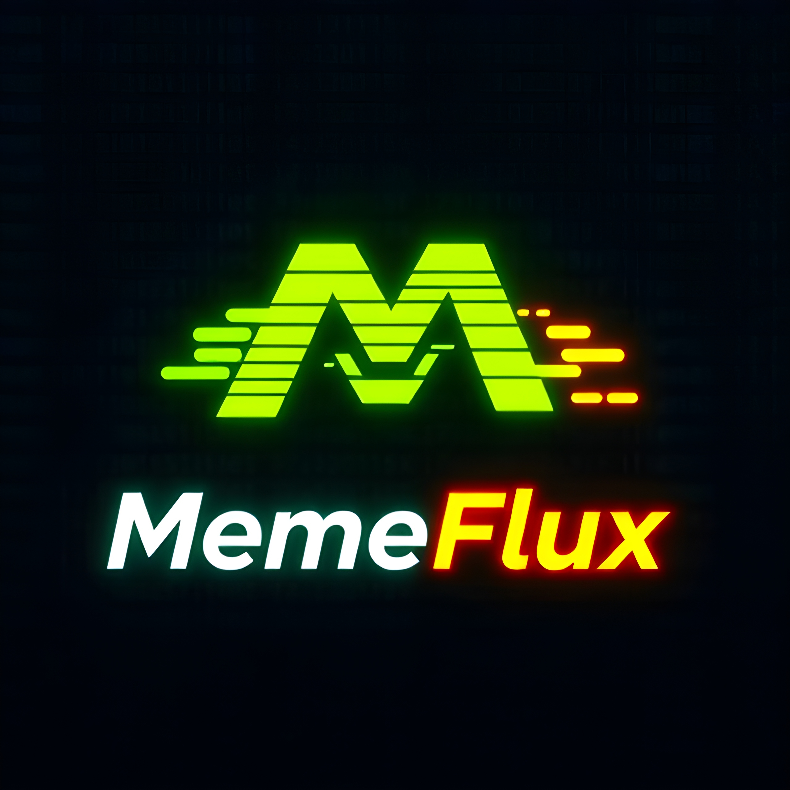

<p align="center">
  
</p>

<h1 align="center">MemeFlux</h1>

<p align="center">
  <a href="https://x.com/TryMemeFlux">🔗 Follow us on Twitter (X)</a>
</p>

# MemeFlux: Advanced AI Generative Models

Welcome to **MemeFlux**, the next-generation AI suite for image, video, and 4D content generation. Built upon cutting-edge diffusion models, MemeFlux provides powerful tools for creating high-quality media with ease.

## 🚀 Features

- **MemeFlux 4D (MF4D)**: Video-to-4D generation with novel-view synthesis.
- **MemeFlux 3D (MF3D)**: Image-to-video generation with multi-view synthesis.
- **MemeFlux Turbo (MFTurbo)**: Fast and high-quality text-to-image generation.

## 📦 Installation

Ensure you have Python 3.9+ installed. Then, install dependencies:

```bash
pip install torch torchvision torchaudio diffusers transformers accelerate
```

For the latest models:

```bash
pip install memeflux
```

## 🖼️ MemeFlux Turbo (Text-to-Image)

```python
from memeflux import MFTurbo

model = MFTurbo()
image = model.generate("A futuristic cyberpunk city at night")
image.show()
```

## 🎥 MemeFlux 3D (Image-to-Video)

```python
from memeflux import MF3D

model = MF3D()
video = model.generate("cyberpunk skyline, neon lights")
video.save("output.mp4")
```

## 🌍 MemeFlux 4D (Video-to-4D)

```python
from memeflux import MF4D

model = MF4D()
video_4d = model.generate("input_video.mp4")
video_4d.save("output_4d.mp4")
```

## 🛠️ Advanced Usage

For additional controls like camera paths, lighting, or multi-frame synthesis, refer to the official documentation.

## 📜 License
MemeFlux is open-source under the Apache 2.0 License.

---

Stay creative with **MemeFlux**! 🚀
